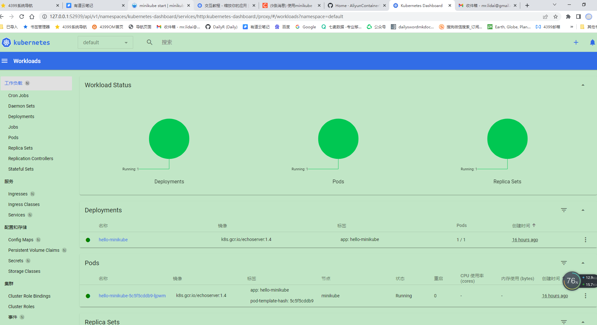
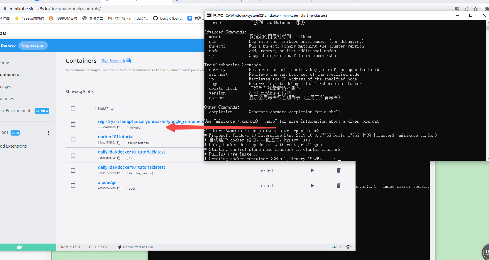
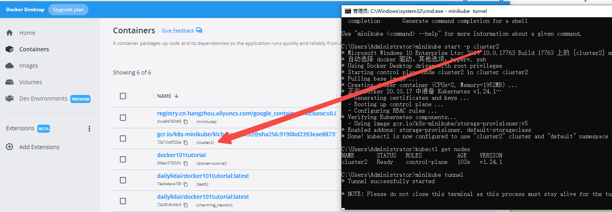

## [minikube](https://minikube.sigs.k8s.io/docs/start/)

- minikube is local Kubernetes, focusing on making it easy to learn and develop for Kubernetes.

- All you need is Docker (or similarly compatible) container or a Virtual Machine environment, and Kubernetes is a single command away: minikube start

- 1. Installation

- 2. Start your cluster
      From a terminal with administrator access (but not logged in as root), run:

      minikube start
      If minikube fails to start, see the drivers page for help setting up a compatible container or virtual-machine manager.

- 3. Interact with your cluster
      If you already have kubectl installed, you can now use it to access your shiny new cluster:

      kubectl get po -A
      Alternatively, minikube can download the appropriate version of kubectl and you should be able to use it like this:

      minikube kubectl -- get po -A
      You can also make your life easier by adding the following to your shell config:

      alias kubectl="minikube kubectl --"
      Initially, some services such as the storage-provisioner, may not yet be in a Running state. This is a normal condition during cluster bring-up, and will resolve itself momentarily. For additional insight into your cluster state, minikube bundles the Kubernetes Dashboard, allowing you to get easily acclimated to your new environment:

      minikube dashboard

- 4. 4Deploy applications
      Create a sample deployment and expose it on port 8080:

      kubectl create deployment hello-minikube --image=k8s.gcr.io/echoserver:1.4
      kubectl expose deployment hello-minikube --type=NodePort --port=8080
      It may take a moment, but your deployment will soon show up when you run:

      kubectl get services hello-minikube
      The easiest way to access this service is to let minikube launch a web browser for you:

      minikube service hello-minikube
      Alternatively, use kubectl to forward the port:

      kubectl port-forward service/hello-minikube 7080:8080
      Tada! Your application is now available at http://localhost:7080/.

      You should be able to see the request metadata from nginx such as the CLIENT VALUES, SERVER VALUES, HEADERS RECEIVED and the BODY in the application output. Try changing the path of the request and observe the changes in the CLIENT VALUES. Similarly, you can do a POST request to the same and observe the body show up in BODY section of the output.

      LoadBalancer deployments

- minikube service hello-minikube

|-----------|----------------|-------------|---------------------------|
| NAMESPACE |      NAME      | TARGET PORT |            URL            |
|-----------|----------------|-------------|---------------------------|
| default   | hello-minikube |        8080 | http://192.168.49.2:31102 |
|-----------|----------------|-------------|---------------------------|
* Starting tunnel for service hello-minikube.
|-----------|----------------|-------------|------------------------|
| NAMESPACE |      NAME      | TARGET PORT |          URL           |
|-----------|----------------|-------------|------------------------|
| default   | hello-minikube |             | http://127.0.0.1:63124 |
|-----------|----------------|-------------|------------------------|
* 正通过默认浏览器打开服务 default/hello-minikube...
! Because you are using a Docker driver on windows, the terminal needs to be open to run it.

- minikube kubectl -- get po -A
NAMESPACE              NAME                                         READY   STATUS             RESTARTS        AGE
default                hello-minikube-5c5f5cddb9-ct7lc              1/1     Running            1 (6m42s ago)   32m
kube-system            coredns-6d4b75cb6d-f8dn9                     1/1     Running            4 (6m42s ago)   54m
kube-system            etcd-minikube                                1/1     Running            5 (6m42s ago)   54m
kube-system            kube-apiserver-minikube                      1/1     Running            5 (6m42s ago)   54m
kube-system            kube-controller-manager-minikube             1/1     Running            5 (6m42s ago)   54m
kube-system            kube-proxy-gshp4                             1/1     Running            6 (6m42s ago)   54m
kube-system            kube-scheduler-minikube                      1/1     Running            6 (6m42s ago)   54m
kube-system            storage-provisioner                          1/1     Running            4 (6m42s ago)   54m
kubernetes-dashboard   dashboard-metrics-scraper-78dbd9dbf5-sbpb2   1/1     Running            2 (6m42s ago)   43m
kubernetes-dashboard   kubernetes-dashboard-5fd5574d9f-fls2d        0/1     ImagePullBackOff   0               43m

- minikube service hello-minikube  上面可以看到自动打开浏览器
链接如下，然后就可以看到对应的参数，就是初始化有点久，耐心等待即可

http://127.0.0.1:63124/

CLIENT VALUES:
client_address=172.17.0.1
command=GET
real path=/
query=nil
request_version=1.1
request_uri=http://127.0.0.1:8080/

SERVER VALUES:
server_version=nginx: 1.10.0 - lua: 10001

HEADERS RECEIVED:
accept=text/html,application/xhtml+xml,application/xml;q=0.9,image/avif,image/webp,image/apng,*/*;q=0.8,application/signed-exchange;v=b3;q=0.9
accept-encoding=gzip, deflate, br
accept-language=zh-CN,zh;q=0.9
connection=keep-alive
host=127.0.0.1:63124
sec-ch-ua=" Not A;Brand";v="99", "Chromium";v="102", "Google Chrome";v="102"
sec-ch-ua-mobile=?0
sec-ch-ua-platform="Windows"
sec-fetch-dest=document
sec-fetch-mode=navigate
sec-fetch-site=none
sec-fetch-user=?1
upgrade-insecure-requests=1
user-agent=Mozilla/5.0 (Windows NT 10.0; Win64; x64) AppleWebKit/537.36 (KHTML, like Gecko) Chrome/102.0.0.0 Safari/537.36
BODY:
-no body in request-

- kubectl port-forward service/hello-minikube 7080:8080
Forwarding from 127.0.0.1:7080 -> 8080
Forwarding from [::1]:7080 -> 8080
Handling connection for 7080
Handling connection for 7080

直接运行转发端口也可以结果跟上面一样

- minikube dashboard
* 正在开启 dashboard ...
  - Using image registry.cn-hangzhou.aliyuncs.com/google_containers/dashboard:v2.6.0
  - Using image registry.cn-hangzhou.aliyuncs.com/google_containers/metrics-scraper:v1.0.8
* 正在验证 dashboard 运行情况 ...
* Launching proxy ...
* 正在验证 proxy 运行状况 ...
* Opening http://127.0.0.1:52939/api/v1/namespaces/kubernetes-dashboard/services/http:kubernetes-dashboard:/proxy/ in your default browser...

- 
- 
- 

- 从中可以看到，minikube 的启动会在docker里面启动一个镜像和服务，如上图所示

- [Accessing apps](https://minikube.sigs.k8s.io/docs/handbook/accessing/)
   - How to access applications running within minikube
      There are two major categories of services in Kubernetes:

      NodePort
      LoadBalancer
      minikube supports either. Read on!

      NodePort access
   - Getting the NodePort using the service command
      We also have a shortcut for fetching the minikube IP and a service’s NodePort:

      minikube service <service-name> --url

   -  这里上面的操作的是成功的

   - minikube service hello-minikube --url
   http://127.0.0.1:65070
   ! Because you are using a Docker driver on windows, the terminal needs to be open to run it.

   - 只有运行特定的命令，minikube才会把应用的访问链接暴露出来
   - 重新运行就会发现每次暴露的端口其实不太一样

- minikube kubectl -- get service hello-minikube
NAME             TYPE       CLUSTER-IP       EXTERNAL-IP   PORT(S)          AGE
hello-minikube   NodePort   10.111.156.222   <none>        8080:32103/TCP   20h

   -  大部分时候 minikube kubectl -- get service hello-minikube 和 kubectl get service hello-minikube 是等效的

Basic usage
To access the dashboard:

minikube dashboard
This will enable the dashboard add-on, and open the proxy in the default web browser.

It’s worth noting that web browsers generally do not run properly as the root user, so if you are in an environment where you are running as root, see the URL-only option.

To stop the proxy (leaves the dashboard running), abort the started process (Ctrl+C).

Getting just the dashboard URL
If you don’t want to open a web browser, the dashboard command can also simply emit a URL:

minikube dashboard --url

minikube dashboard  可以做很多方便的操作，直接在网页上进行操作

LoadBalancer deployments 
To access a LoadBalancer deployment, use the “minikube tunnel” command. Here is an example deployment:

kubectl create deployment balanced --image=k8s.gcr.io/echoserver:1.4  
kubectl expose deployment balanced --type=LoadBalancer --port=8080
In another window, start the tunnel to create a routable IP for the ‘balanced’ deployment:

minikube tunnel
To find the routable IP, run this command and examine the EXTERNAL-IP column:

kubectl get services balanced
Your deployment is now available at <EXTERNAL-IP>:8080

   LoadBalancer  模式一直没成功，不知道为什么，等真正需要用的时候再仔细查把，不然回报比比较低

来来去去就用了一下午去调试这些命令，就是对这些对象进行命令行操作

kubectl describe services example-service

kubectl get po -o wide

kubectl delete deployment hello-minikube7

kubectl delete service hello-minikube7

kubectl get po -A

kubectl create deployment balanced --image=k8s.gcr.io/echoserver:1.4

kubectl expose deployment balanced 

kubectl get services balanced

kubectl expose deployment balanced 

kubectl create deployment balanced1 

kubectl expose deployment balanced1 

kubectl get services balanced

get services balanced1

kubectl describe services balanced1

minikube service balanced1 --url

kubectl describe service balanced1

kubectl describe services balanced1

minikube service list

kubectl describe services balanced1

kubectl get svc

kubectl delete service balanced1

kubectl get svc

kubectl expose deployment balanced1 
kubectl get svc

kubectl delete service nginxpublic

kubectl get svc

kubectl expose deployment balanced1 
minikube service list

kubectl delete service dailytest1

kubectl get deployments -A

kubectl expose deployment dailytest2 --type=LoadBalancer --port=7777 --target-port=7777 --name=dailytest3
service/dailytest3 exposed

minikube service list

kubectl create deployment dailytest3 --image=k8s.gcr.io/echoserver:1.4

kubectl expose deployment dailytest2 --type=LoadBalancer --port=80 --target-port=8888 --name=dailytest2
service/dailytest2 exposed

minikube service dailytest2

kubectl get services dailytest2

kubectl delete deployment dailytest2
 