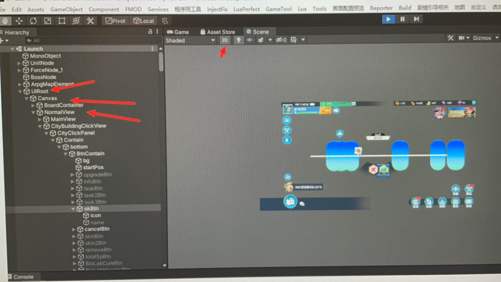

# lua&Luamon practices & study notes

## 关于LuaMon   （名称：luamon调试和自动化测试，类似于内挂）

LuaMon 是一个 unity for lua 的实时调试工具，有点像 hunter 系统，不同的是前者是连接客户端，后者是服务端连接，也接受客户端数据

## luaMon 的适用场景

- 实时lua逻辑修改，数据打印，调试
- 热重载开发(保存即生效的开发体验是不是想想就很美？)
- 无线真机调试(有网络限制)
- 真机日志输出
- 多人联调

## 实现原理
其原理非常简单，在游戏启动一个长连接服务。Cient端运行时自动与游戏服务连接，本地修改的`*.lua`文件或代码将实时提交到服务器lua虚拟中执行，并将结果返回本地


## 什么是Hunter？

Hunter是一个游戏调试和测试的云平台，通过网络将设备与平台连接在一起，实时进行数据传输。
从游戏获取数据。 可以从游戏中实时获取log、文件与资源、脚本包结构、运行性能参数等。
向游戏发送数据。 可以发送数据到游戏中，实现调用GM指令、文件动态更新、远程过程调用（RPC）等。
简单易用的web操作界面。 开放RESTful API供自动化测试的接口调用。
开放平台。允许第三方应用接入Hunter并获得用户授权，以代替用户的操作，用于自动化测试和流程。


## annotation 注释

- 里面有一些代码行数和参考理解的例子，很多时候照搬就可以，但是结构和架构就得自己思考

##  已完成的里程碑

- Chapter1_regress.lua   第一章的自动化回归

- Ui_regress.lua     UI自动化回归

- 一些辅助的可以从 NoteSelfSample 或者各种get各种data来获取数据


### 用python selenium 作为工具的衔接和组件拼装

- 详见chrome_selenium_webdriver 目录下的 luamon_regress.py

- 大致思路是把通过cygwin的 sed 删除 luam文件里注释所在行  sed -i '/xxx/d' filename(由于要为了避免一些编码问题，所以才去了cygwin 处理文本， $ LANG=C sed '/--/d' Chapter_gress_test.lua > temp.lua)

- Chapter1_gress_test.lua 是带有中文注释的文件，直接读取会有编码问题，所以sed处理后就是把--所在行删除，放在一个temp.lua文件里，详见sed的运用（如果不放心，可以 LANG=C sed -i -e 's/[\81-\xFE][\x40-\xFE]+//g' Chapter1_regress_test.lua,这个是删除文件里的中文字符，一般上面的sed处理后就是--所在行删除就足够了，所以文件里的--注释一般做单独一行，就是为了不影响原有代码）

- 然后用selenium调用web控件，将要执行的代码和temp.lua复制进去，点击运行

- 检验运行结果就好了


### Unity相关的基础知识

- prefab

- assetsbundle

- 文件目录结构

- SceneId,SLGMap, Guide

- 详细见 Unity_Editor 里面的相关资源知识，luaMon做业务支撑是足够了


### 需要补充的调试脚本

- Guide_chapter1_regerss.lua

- 

### 隔一段时间后重新捡起来

- 调整目录和文件名

- 从登录流程开始解释 - 登录界面

- 通过各个环节的状态判断当前的正式初始状态，

	- 例如判断是否处于新手，是否处于SlgLogin登陆界面
	- 是否在播放剧情，是否在loading中，是否在塔防中

- 战斗，派出部队，出征队列

### 思考

- 重要的是思考思路，而不是记忆某一个函数名字

- 学习很重要，但是学习如何去学习更重要（方法）

- Has a lot of great study notes.(翻译：大量的学习笔记)
- [Knowledge sharing and collaboration without distractions](https://stackoverflow.co/teams/)
- 无干扰的知识共享和协作. 至今仍然非常喜欢Stack Overflow的这句solgon,比起百度上面的很多浪费时间精力的搜索和结果，https://stackoverflow.co/teams/上面的话真的深入我心。

- Auto Generate 自动生成， gen 生成

#### [EasyTest里面的lua的想法](../EasyTest/README.md)


#### [EasyTest里面的lua的想法,thinking lua & luamon 一些关于](../EasyTest/README.md)  其实上面这几个文档是相互链接的

#### [基于战斗测试用例的一些思考]

- 像之前比较稳定的从新手登录界面，创建账号，完成引导，第一章节任务，升级到主堡2级的这个 Guide_chapter1_regress.lua（稳定超过半年以上），其中提取的思路最重要的是区分各个界面是否处于打开状态，来判断游戏所处的状态，来采取不同的行为action措施来获取对应的result，assert对应的测试结果是否通过。

- 像升级到主堡等级2级后的，这个任务，关卡，战斗，所处状态的判断，是衔接后续出内城进行战斗的很重要的逻辑关键点。（key points）
	- 拆解步骤：
		1. 打开对应的策划表，相关表，如新手关卡相关就行 \Z 主城玩法\J 具体关卡配置（guanka）.xlsx 
		2. 测试获取配置的代码，从Guide_chapter1_regress.lua里面提炼
		3. 放到一个个小sample去测试当前的condtion.
		4. 打开perfect lua项目工程去看相关的例子，查找相关的函数
		5. 同步内外网，study notes书写。

	- 具体实例：
		- 类似关卡，新手，任务系统（这几个其实是关联的，就是玩家开始真正游戏的前面10分钟接触的主要系统和后面的核心），这几个系统相互直接的关联，那么要打开的表就包括：
			- \Z 主城玩法\J 具体关卡配置表（guanka）.xlsx
			- \R 任务\Z 主线任务chaptertask.xls
			- \R 任务\Z 章节任务指引表 task_group.xlsx

		- 主要就是上面这3个文件，理解并且构建它们之间的关系，即可完成任务自动化测试的思路主框架
		- task_group是对应的任务id，任务组关系，然后解析这个任务组对应的任务id，里面的task_act 代表不同的引导行为
		- chaptertask里面的任务id，对应的是1001这种，然后view字段表示要跳转的功能组，{"taskGroup":1001} 这种获取里面的taskgroup_id, 在 Guide_chapter1_regress.lua里的301行 DataBase.GetSysBaseData_ChaptertaskByKey(id).view[2]，意思就是获取对应的group_id了，然后condition这个其实没用到，这个是主线任务的任务条件，这个对着代码看，思考下就知道上面意思了。
		- 然后chpatertask里面的id顺序是正常的任务，主界面左下角显示的就是取的配置id最小的未完成任务。
		- chapter_task里面各个任务id对应的task_act ，可以查看说明表，这样对每个类型能知道对应什么处理。

	- 理解了对应的逻辑关系和配置表关系，就可以开始在luamon web端调测了，这个需要大量的练习practices:

```lua
local main = function 
	local taskSub = UIMgr.GetView("MainView").MainView_LeftBottomPanel_Sub
	local state   = taskSub.TaskSV.GetDataByIndex(1).state  --1:未完成， 2：已完成
	--获取当前任务id
	local id  = taskSub.TaskSV.GetDataByIndex(1).task_id
	local sort =  taskSub.TaskSV.GetDataByIndex(1).sort	
	-- 跟进id去获取out_chaptertask表里

	local config_task_group = DataBase.GetSysBaseData_ChaptertaskByKey(id).view[2]
    --获取任务的任务组映射值
    local config = DataBase.GetSysBaseData_Task_groupByTitle("guide_group",config_task_group)  

    feiPrint(config[1].id)

    local conifg_act = Data.GetSysBaseData_Task_groupByKey(18)

    feiPrint(config_act)
    -- return config_act.task_act[3][2]

    return TableCount(config_act.task_act[3])

end
return main()

```

	- 上面就是任务配置表读到配置的关键代码
	- 通过排列组合各个状态，和各个条件，像搭建乐高积木一样搭建自己的测试用例，CRUD信手拈来。

	- 想要完成的3个主要用例 ： 
		- 1. 新手和关卡， 
		- 2. 内城关卡战斗，
		- 3. 外城出征及战斗。
		（第一个已完成，第二个做到一半，第三个还没开始做。）

	- 在程序的文档说明Docs里面，看到了TaskDataCache作为数据的存储和处理（类似于之前之前项目里面的module，

		- 其中1已经是完成了
		- 2内城关卡战斗可以开始组织积木和拼图了，其中最重要的一块是获取关卡数据
		- \Z 主城玩法\J 具体关卡配置表（guanka）.xlsx 这个在上面提到的这里是很重要的数据，然后符合条件的执行对应的action
		- Army_Fighting.lua
		- Army_InnerCity_Move.lua
		- Army_Send_Inner_City.lua
		- 上面提到的几个文件，就是战斗的执行细分例子


#### [EasyTest里面的lua的想法](../EasyTest/README.md)

- 这里与上面相同，这两个links

#### [EasyTest里面的lua的想法,thinking lua & luamon 一些关于](../EasyTest/README.md)  其实上面这几个文档是相互链接的

- 像之前比较稳定的从新手登录界面，创建账号，完成引导，第一章节任务，升级到主堡2级的这个 Guide_chapter1_regress.lua（稳定超过半年以上），其中提取的思路最重要的是区分各个界面是否处于打开状态，来判断游戏所处的状态，来采取不同的行为action措施来获取对应的result，assert对应的测试结果是否通过，这个就类似于动画端帧率，不断的在每一帧判断对应的状态，然后执行对应的效果，然后完成一系列的拼装之后，达到测试的原始预期，达成测试用例端执行完成。
- 这个有点像单帧端动画播放，然后连成一体，形成的测试用例。

	- 由于新手现在不稳定，所以做两个操作，增加gm的资源，然后执行对应的action

	- python端相当于control端，对观察者模式的lua进行判定

- 接下来先拼装单帧的状态和行为逻辑代码

	- 1. 先执行一下之前比较稳定的从新手登录界面，创建账号，完成引导，第一章节任务，升级到主堡2级的这个 Guide_chapter1_regress.lua。

	- 2. 完成了执行后，得到一个升级到2级的目标账号，其实也可以用新账号，但是用新账号会走一遍之前的流程，如果是已经达到对应的等级账号了，那么可以直接去完成对应的接下来的任务。（新账号与旧账号的使用，初始化的区别思考还待梳理）

	- 3. 当前先继续用这个账号进行调试

	- 4. 任务数据和关卡的数据获取，然后执行出城等操作

- 然后在上面的任务数据获取上做了些修改

```lua
local main = function 
	local taskSub = UIMgr.GetView("MainView").MainView_LeftBottomPanel_Sub
	local state   = taskSub.TaskSV.GetDataByIndex(1).state  --1:未完成， 2：已完成

	--获取当前任务id
	local id  = taskSub.TaskSV.GetDataByIndex(1).task_id
	local sort =  taskSub.TaskSV.GetDataByIndex(1).sort	
	-- 跟进id去获取out_chaptertask表里

	local config_task_group = DataBase.GetSysBaseData_ChaptertaskByKey(id).view[2]
    --获取任务的任务组映射值

    -- 任务id的组映射
    local config = DataBase.GetSysBaseData_Task_groupByTitle("guide_group",config_task_group)  

    --feiPrint(config[1].id)

    -- 这里通过DataBase.GetSysBaseData_Task_groupByTitle 获取了3个长度的数组

	for i =1,#config do 
	    local conifg_act = config[i].task_act

	    feiPrint(config_act)

	end

    -- return config_act.task_act[3][2]

    return TableCount(config_act.task_act[3])

end
return main()

```

#### 继续在当前的条件下进行调试获取数据，执行对应的行为

- Unity里面查看对应的控件名字

	1. 切换成#scene场景(注意game和scene的目标对应性，要先在游戏里到对应的地
	2. 点击2D
	3. 选择UIRoot-Canvas到达UI层，这样就能看到下图的这图片了
	4. 然后点选对应#scene场景里面看到的这个UI层，选中对应的控件
	5. 就可以从右边的Inspector获取对应的信息了

	- 


